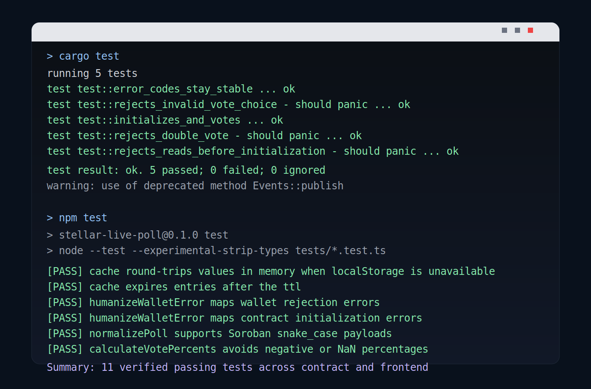
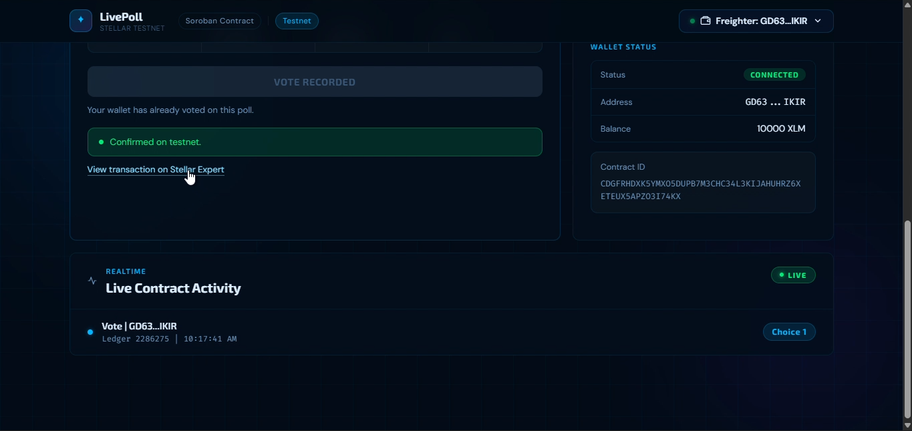

# LivePoll Mini-dApp

LivePoll is a small end-to-end Stellar Soroban mini-dApp for testnet. It includes a Soroban smart contract for a one-question poll, a React frontend with multi-wallet support, automated tests, and deployment/docs material for a short project submission.

## Deliverable overview

- Smart contract for poll initialization, voting, and vote lookup
- React frontend for wallet connect, poll initialization, voting, and live refresh
- Frontend and contract tests
- Setup, deploy, and submission-ready documentation
- Requirement checklist in [docs/requirements-check.md](/f:/Steller/livepoll-mini-dapp/docs/requirements-check.md:1)

## Repository structure

```text
livepoll-mini-dapp/
|- contracts/
|  |- live_poll/
|  |  `- src/
|  |     |- lib.rs
|  |     `- test.rs
|  `- scripts/
|     `- deploy-testnet.ps1
|- docs/
|  |- images/
|  `- ...
`- frontend/
   |- src/
   |- tests/
   `- .env.example
```

## Features

- One-question on-chain poll deployed on Stellar testnet
- One vote per wallet address
- Wallet support for Freighter, xBull, Albedo, LOBSTR, Rabet, and Hana
- Transaction lifecycle feedback from signing through confirmation
- Poll state and wallet vote caching for faster reloads
- Contract event feed sourced from Stellar RPC

## Live demo

- Deployed app: `https://livepoll-mini-dapp.netlify.app/`
- Demo video: `https://drive.google.com/file/d/11M34NFfMhx-YCESKixXsz0nZfDKVs7gn/view?usp=drive_link`

## Testnet configuration

- Contract ID: `CDGFRHDXK5YMXO5DUPB7M3CHC34L3KIJAHUHRZ6XETEUX5APZO3I74KX`
- Network: `Test SDF Network ; September 2015`
- RPC: `https://soroban-testnet.stellar.org`
- Horizon: `https://horizon-testnet.stellar.org`
- Deployment transaction: `f72a461608d5a6eb746e1473f183d32ff4b88b24bcc04f3bf50addcd1de8b875`

## Local setup

### Frontend

```powershell
cd frontend
Copy-Item .env.example .env
& "C:\Program Files\nodejs\npm.cmd" install
& "C:\Program Files\nodejs\npm.cmd" run dev
```

### Contract

```powershell
cd contracts
cargo test
stellar contract build
```

## Verification commands

```powershell
cd frontend
& "C:\Program Files\nodejs\npm.cmd" run test
& "C:\Program Files\nodejs\npm.cmd" run build
```

```powershell
cd contracts
cargo test
```

## Passing test output



- Contract tests: `5 passed`
- Frontend tests: `6 passed`
- Total verified passing tests: `11`

## Demo assets

- Screenshots: [docs/images](/f:/Steller/livepoll-mini-dapp/docs/images:1)
- Post-vote screen:



## Notes

- The frontend `.env` is intentionally ignored; use `.env.example` as the template.
- Contract tests currently pass, but `cargo test` emits Soroban event deprecation warnings from `Events::publish`.
