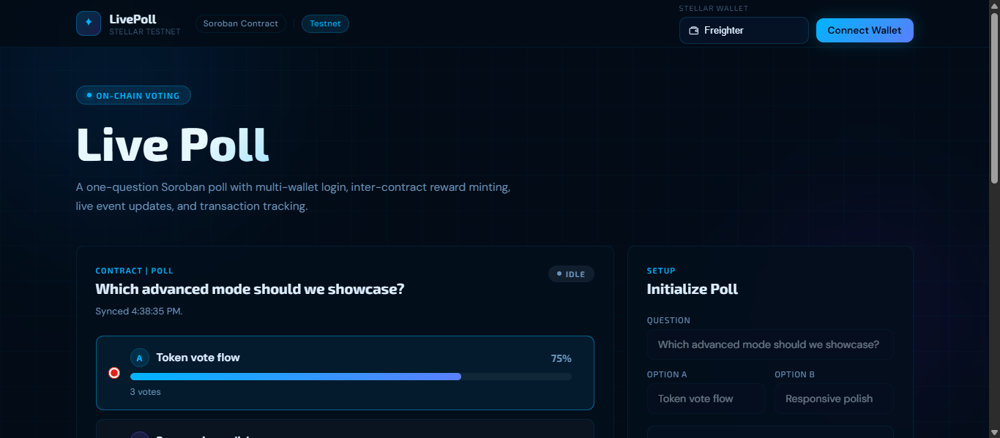
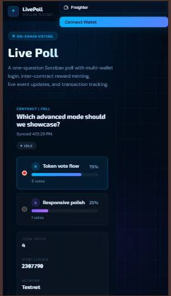
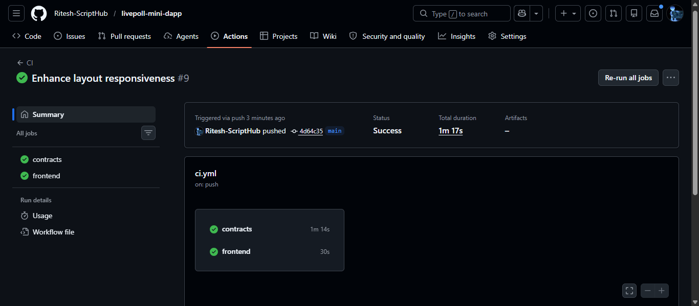

# LivePoll Mini-dApp

LivePoll is a small end-to-end Stellar Soroban mini-dApp for testnet. It now includes a poll contract plus a separate reward-token contract, a React frontend with multi-wallet support, automated tests, and deployment/docs material for an advanced project submission.

## Live demo

- Deployed app: `https://livepoll-mini-dapp.netlify.app/`
- Demo video: `https://drive.google.com/file/d/1u2b5kxg-GHxfQPh-K-y7CBHzZbKRpRDU/view?usp=drive_link`

## Deliverable overview

- Smart contracts for poll initialization, voting, vote lookup, and reward-point minting
- React frontend for wallet connect, poll initialization, voting, and live refresh
- Frontend and contract tests
- Setup, deploy, and submission-ready documentation
- Requirement checklist in [docs/requirements-check.md](docs/requirements-check.md)

## Repository structure

```text
livepoll-mini-dapp/
|- contracts/
|  |- live_poll/
|  |- poll_reward_token/
|  |  `- src/
|  |     |- lib.rs
|  |     `- test.rs
|  `- scripts/
|     `- deploy-testnet.ps1
|- docs/
|  |- images/
|  `- ...
`- frontend/
   |- src/
   |- tests/
   `- .env.example
```

## Features

- One-question on-chain poll deployed on Stellar testnet
- One vote per wallet address
- Each successful vote mints reward points through an inter-contract Soroban call
- Separate `poll-reward-token` contract with admin handoff and total mint tracking
- Wallet support for Freighter, xBull, Albedo, LOBSTR, Rabet, and Hana
- Transaction lifecycle feedback from signing through confirmation
- Poll state and wallet vote caching for faster reloads
- Contract event feed sourced from Stellar RPC
- GitHub Actions CI for contract tests plus frontend lint/build/test
- Root-level `netlify.toml` so Netlify can deploy the repo from the monorepo without moving the frontend

## What's New In The Advanced Version

- Added an inter-contract reward flow where `live_poll.vote_for` mints points through the separate `poll_reward_token` contract.
- Expanded the Soroban workspace to include the custom `poll_reward_token` contract with mint tracking and admin handoff support.
- Added repository CI with GitHub Actions for contract tests plus frontend test/lint/build verification.
- Added root-level Netlify deployment config with SPA routing support through `netlify.toml`.
- Updated the frontend to surface reward-token details and improved mobile behavior for action controls, analytics cards, and the live activity feed.
- Added legacy-safe frontend behavior so older deployed contracts without `vote_for` now fall back to `vote` automatically.
- Added support for both `VITE_STELLAR_REWARD_TOKEN_ID` and `VITE_STELLAR_VOTE_TOKEN_ID` environment variable names.
- Redeployed the advanced poll and reward-token contract pair on Stellar testnet and updated the frontend environment to point at the live advanced deployment.


## Testnet configuration

- Poll Contract ID: `CBRGNWEUASYW7IPGZTST7NQWCUUXPMZR236NIGVPQGPY6ZJAXQ5SATVY`
- Reward Token Contract ID: `CAEACAAUTW6JP5LGBFQHAXOLXNBVNPRPOFOHNRH5DEAA6AMWACA5YF3L`
- Network: `Test SDF Network ; September 2015`
- RPC: `https://soroban-testnet.stellar.org`
- Horizon: `https://horizon-testnet.stellar.org`
- Reward token deploy transaction: `6194f8a682f7f0a3e613d238e8a6e3d9eb2e6a3cf48d628930228bd988c4414b`
- Reward token init transaction: `fe3a6b8e42a7717fd5c4afa872f883bc551450a83d1d04d2f8ec45cd796908f9`
- Poll deploy transaction: `35403b04eb27d11eacb2d6035ae578baeb3db0ba0aa9fdb7bdd224733f141826`
- Poll init transaction: `4b74afdd7a270729e5f8f9ff725d92f0f758dabb192cb4d1e8c23d1dc008fa7c`
- Verified `vote_for` reward-mint transaction: `4f45efe666c4789d20ce938cacdf08b4bd9fbc2b850dc37116c37c9d17ead53a`

## Local setup

### Frontend

```powershell
cd frontend
Copy-Item .env.example .env
& "C:\Program Files\nodejs\npm.cmd" install
& "C:\Program Files\nodejs\npm.cmd" run dev
```

### Contract

```powershell
cd contracts
cargo test
stellar contract build
```

## Verification commands

```powershell
cd frontend
& "C:\Program Files\nodejs\npm.cmd" run test
& "C:\Program Files\nodejs\npm.cmd" run lint
& "C:\Program Files\nodejs\npm.cmd" run build
```

```powershell
cd contracts
cargo test
```

## Verification summary

- Contract tests: `5 passed`
- Frontend tests: `6 passed`
- Total verified passing tests: `11`

## Demo assets

- Screenshots: [docs/images](docs/images)
- Desktop dashboard view:



- Mobile responsive view:



- Post-vote screen:


## CI/CD

- GitHub Actions runs on every push and pull request.
- The `contracts` job runs `cargo test` inside `contracts/`.
- The `frontend` job runs `npm ci`, `npm run test`, `npm run lint`, and `npm run build` inside `frontend/`.
- This keeps the advanced pair validated across both the Soroban contracts and the React frontend before deployment.



## Deployment Flow For The Advanced Pair

1. Build the Soroban workspace with `stellar contract build` from `contracts/`.
2. Fund or create the deployment identity on Stellar testnet.
3. Deploy the `poll_reward_token` contract first and capture its contract ID.
4. Deploy the `live_poll` contract second and capture its contract ID.
5. Initialize the reward-token contract with the deployer as admin and the poll contract as minter.
6. Initialize the poll contract with the reward-token contract ID, question, and both options.
7. Update `frontend/.env` with `VITE_STELLAR_CONTRACT_ID` and `VITE_STELLAR_REWARD_TOKEN_ID` so the UI points to the live advanced deployment.
8. Deploy the frontend through Netlify using the root `netlify.toml` monorepo configuration.

The repo includes [`contracts/scripts/deploy-testnet.ps1`](contracts/scripts/deploy-testnet.ps1) to automate this end-to-end testnet flow, including the frontend env update for the advanced contract pair.

## Notes

- The frontend `.env` is intentionally ignored; use `.env.example` as the template.
- Set both `VITE_STELLAR_CONTRACT_ID` and `VITE_STELLAR_REWARD_TOKEN_ID` in `frontend/.env` for local end-to-end testing.
- The poll contract now expects the reward-token contract to be initialized with the poll contract as its minter before voting rewards can mint successfully.
